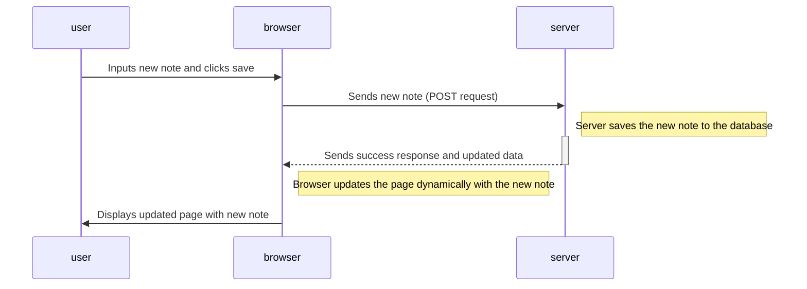

```mermaid
sequenceDiagram
    participant user
    participant browser
    participant server

    user->>browser: Inputs new note and clicks save
    browser->>server: Sends new note (POST request)

    Note right of server: Server saves the new note to the database
    activate server
    server-->>browser: Sends success response and updated data 
    deactivate server

    Note right of browser: Browser updates the page dynamically with the new note

    browser->>user: Displays updated page with new note
```
