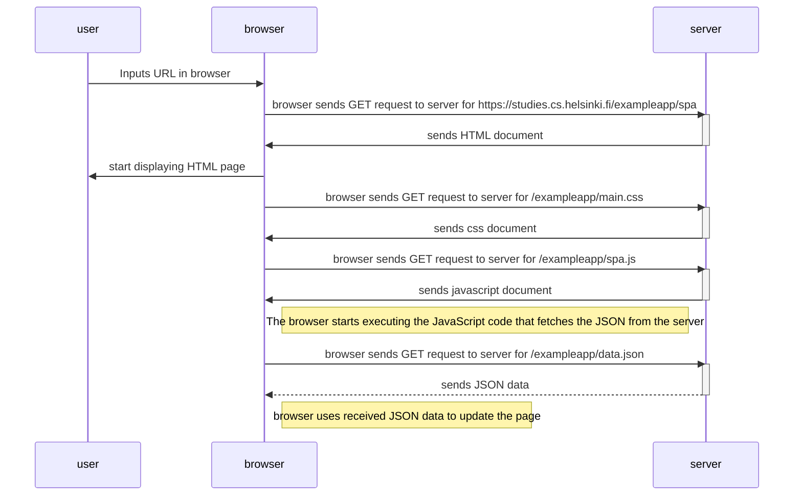

```mermaid
sequenceDiagram
participant user
participant browser
participant server

user->>browser: Inputs URL in browser

browser->>server: browser sends GET request to server for https://studies.cs.helsinki.fi/exampleapp/spa

activate server
server->>browser: sends HTML document 
deactivate server

browser->>user: start displaying HTML page

browser->>server: browser sends GET request to server for /exampleapp/main.css

activate server
server->>browser: sends css document 
deactivate server

browser->>server: browser sends GET request to server for /exampleapp/spa.js

activate server
server->>browser: sends javascript document 
deactivate server

Note right of browser: The browser starts executing the JavaScript code that fetches the JSON from the server

browser->>server: browser sends GET request to server for /exampleapp/data.json

activate server
server-->>browser: sends JSON data
deactivate server

Note right of browser: browser uses received JSON data to update the page
```
